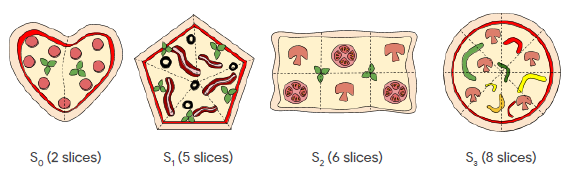

# HashCode2020
Hi! I'm **Saurabh**, a python developer.
## Problem Description
You are organizing a Hash Code hub and want to order pizza for your hub's participant. Luckily, there is a nearby pizzeria with really good pizza.

The pizzeria has different types of pizza, and to keep the food offering for your hub interesting, you can only order **at most one pizza of each type**. Fortunately, there are many types of pizza to choose from!

Each type of pizza has a specified size: the size is the number of slices in a pizza of this type.

You estimated the maximum number of pizza slices that you want to order for your hub based on the number of registered participants. In order to reduce food waste, your goal is to order **as many pizza as possible,** but **not more than the maximum number.**

## Input data set
### File format
Each input data set is provided in a plain text file containing exclusively ASCII characters with lines terminated with a single '\n' character (UNIX-style line endings).

The first line of the dataset contains the following data:
* an integer **M** ( 1 ≤ **M** ≤ 10 9 ) – the maximum number of pizza slices to order
* an integer **N** ( 1 ≤ **N** ≤ 10 5 ) – the number of different types of pizza

The second line contains N integers – the number of slices in each type of pizza, in non-decreasing order:
* 1 ≤ S 0 ≤ S 1 ≤ … ≤ S N-1 <= **M**
### Example
| Name | Description |
|-------------|:--------------|
|17 4         |**17** slices maximum, **4** different types of pizza|
|2 5 6 8      |type **0** has **2** slices, type **1** has **5**, type **2** has **6** and type **3** has **8** slices


## Submissions
### File format
The output should contains two lines:
* The first line should contain a single integer **K** (0 ≤ **K** ≤ **N**) – the number of different types of pizza to order.
* The second line should contain **K** numbers – the types of pizza to order (the types of pizza are numbered from 0 to **N**-1 in the order they are l isted in the input).

The total number of slices in the ordered pizzas must be less than or equal to **M**.
### Example
| Submission file | Description       |
|-----------------|:------------------|
|3                |**3** types of pizza|
|0 2 3            |ordering pizza: **S<sub>0</sub>**, **S<sub>2</sub>** and **S<sub>3</sub>**|
## Scoring
The solution gets 1 point for each slice of pizza ordered.
<table><tr><td>For **example**, above we ordered 3 pizzas: **S<sub>0</sub>**, **S<sub>2</sub>** and **S<sub>3</sub>**. We know that the pizza slices in each of these are 2, 6, and 8 respectively.</br>So the score is: 2+6+8 = **16 points**</td></tr></table>

**Note that there are multiple data sets representing separate instances of the problem. The final score for your team will be the sum of your best scores for the individual datasets.**

<hr>

# Steps for getting the output
* Place all the input files in a subfolder named **input** where the hashCode2020.py exist
* Run the **hashCode2020.py** program within same directory with terminal or command prompt. </br>Example: ```python hashCode2020.py```
* Enter the input file name without **'.in'** extension
* The output file will be generated with the file name with **'.out'** extension in the output subfolder.
* Use any text editor for viewing the output.
